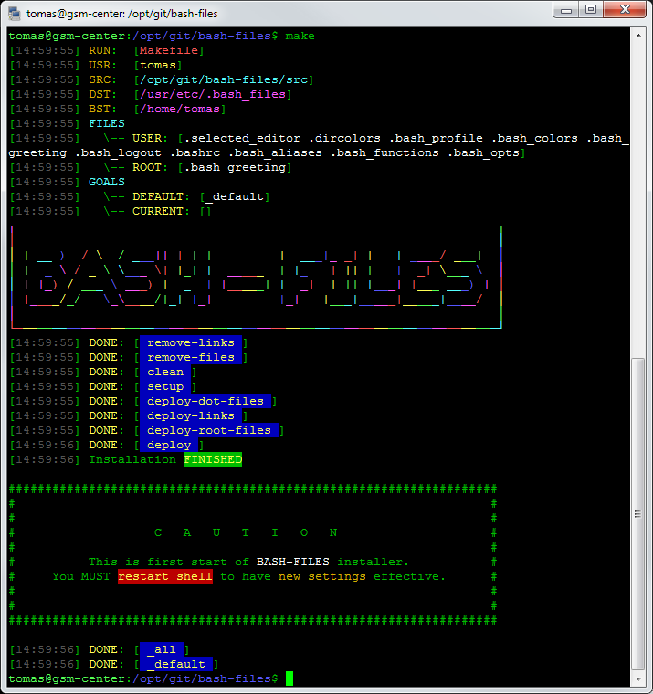
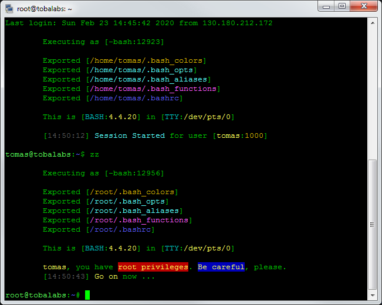
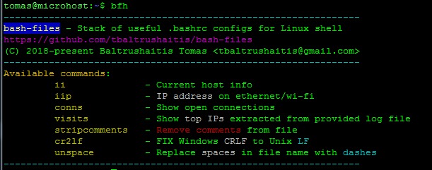
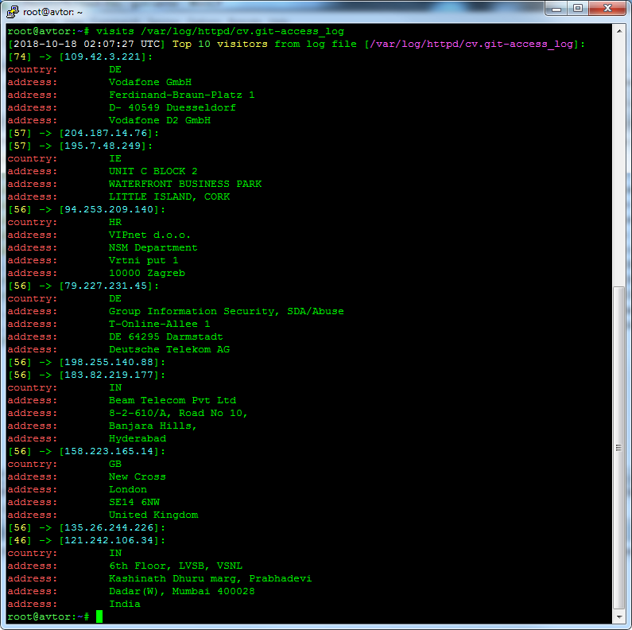
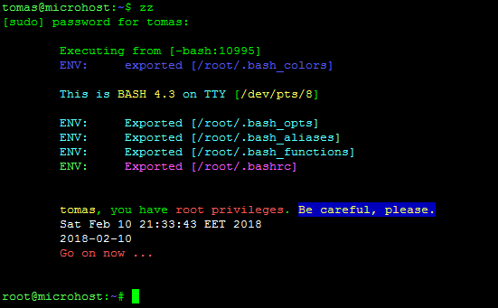
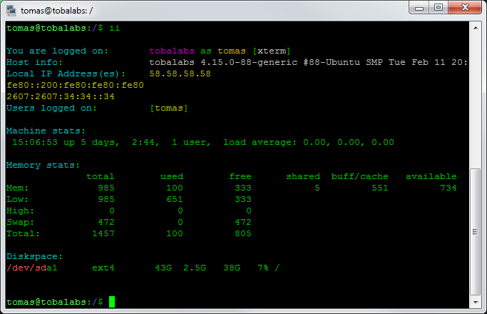

<p align="center">
  <h2 align="center">Easy Shell</h2>
</p>

<p align="center">
  <a href="#">
    
  </a>
</p>

<!-- # Linux Configs :: Stack of useful .bashrc configs for OS Linux shell # -->

<p align="center">
  <h4 align="center">Stack of useful .bashrc configs for Linux shell</h4>
</p>

<!-- <p align="center">
<a href="https://github.com/tbaltrushaitis/bash-files/blob/master/LICENSE"></a>
</p> -->

`bashrc` `tips-and-tricks` `configuration` `bash-scripting` `bash-alias` `shell-scripts` `colorization` `linux-shell`

#### :package: Provides: ####
- [x] Colorful console output
- [x] Easy-to-remember aliases for most of commands with their top-used params
- [x] Up to 70% economy of your keyboard input time
- [x] Collect and gather basic system stats for fast incidents investigations

#### How to setup this useful **.bashrc configs** into your OS? ####
Installation is so easy as so koala :koala: can do it.
Read below!

---

## Usage ##

### 1. Download ###
```shell
$ APP_NAME=bash-files \
&& git clone https://github.com/tbaltrushaitis/${APP_NAME}.git \
&& cd ${APP_NAME} ;
```

### 2. Setup for current user and root ###
```shell
$ make
```

<div align="center">
  
</div>

---

## 3. Thats all. Enjoy! ##

<div align="center">
  
</div>

---

## Aliases explained ##

<details open>
  <summary>bfh - Help topic</summary>
  <div align="center">
    
  </div>
</details>

<details>
  <summary>visits - List of top ip-addresses extracted from given log file</summary>
  <div align="center">
    
  </div>
</details>

<details>
  <summary>zz - Become root</summary>
  <div align="center">
    
  </div>
</details>

<details>
  <summary>qq - Logout from current session</summary>
  <div align="center">
    
  </div>
</details>

<details>
  <summary>ii - Show basic hardware and networking information about the host</summary>
  <div align="center">
    
  </div>
</details>

---

## Special tools aliases ##

| + | Input | Execute | Description |
|:-:|:-----:|:--------|:------------|
| - | visits | f(<LOG_FILE>, [COUNT]) | Show top [COUNT] IPs extracted from <LOG_FILE> |
| - | delempty | find . -type f -size 0 -exec rm -v {} \; | Find all empty files and delete them |
| - | scs | screen -ls | Show list of active screens |
| - | scx | screen -x | Attach to the screen which name is provided as parameter |
| - | scr | screen -S "sockname" | Create new screen session with name provided as parameter, e.g. <pid>.sockname |
| - | psnode | ps | Show node.js processes |
| - | zz | sudo -i | Become root |
| - | qq | exit | Exit current session |
| - | iip | f() | Show IP adress on ethernet/wi-fi |
| - | conns | f() | Output list of network connections ESTABLISHED |
| - | stripcomments | sed -r "/^(#\|$)/d" -i <FILE> | Remove comments (#) and empty lines from FILE |
| - | nocomment | grep -Ev "^(#\|$)" <FILE> | Show FILE contents without comment (#) and empty lines |
| - | cr2lf | sed -i 's/\r$//' <FILE> | FIX Windows (CRLF) to Unix (LF) in <FILE> |
| - | unspace | f(<FILE>) | Replace spaces in file name with dashes |
| - | mkd | f(<NEW_NAME>) | Create a new directory and enter it |

## Full command-line aliases list ##

| + | Input | Execute | Description |
|:-:|:-----:|:--------|:------------|
| - | med | mcedit -a | Run Midnight Commander's editor |
| - | .. | cd .. | Go up 1 directory |
| - | c | clear | Clear terminal window |
| - | screenls | screen -ls | Show list of active screens |
| - | k9 | kill -9 | Send -HUP signal to process |
| - | npmr | npm run | -
| - | npms | npm start | -
| - | npmt | npm run test | -
| - | npmb | npm run build | -
| - | npmo | npm outdated | -
| - | alert | notify-send --urgency | -
| - | chgrp | chgrp --preserve-root | -
| - | chmod | chmod --preserve-root | -
| - | chown | chown --preserve-root | -
| - | cp | cp -prb | -
| - | cpuinfo | lscpu | -
| - | curli | curl -I | -
| - | debug | set -o nounset; set -o xtrace | -
| - | df | df -kTH | -
| - | dir | dir --color | -
| - | du | du -kh | -
| - | egrep | egrep --color | -
| - | fastping | ping -c 100 -s.2 | -
| - | fgrep | fgrep --color | -
| - | grep | grep --color | -
| - | h | history | Show commands history |
| - | pwg | pwgen -s1 32 | Generate strong password |
| - | headerc | curl -I --compress | -
| - | httpdtest | sudo /usr/sbin/apachectl -t && /usr/sbin/apachectl -S | -
| - | httpdreload | sudo /usr/sbin/apachectl -k graceful | -
| - | httpdrestart | sudo /etc/init.d/httpd restart | -
| - | ipt | sudo /sbin/iptables -n -v --line-numbers -L | -
| - | iptlist | ipt | -
| - | iptlistfw | ipt FORWARD | -
| - | iptlistin | ipt INPUT | -
| - | iptlistout | ipt OUTPUT | -
| - | firewall | iptlist | -
| - | j | jobs -l | -
| - | l | ls -CF | -
| - | la | ll -A | -
| - | lc | ls -ltcr | -
| - | libpath | echo -e ${LD_LIBRARY_PATH//:/\\n} | -
| - | lk | ls -lSr | -
| - | ll | ls -lvF | -
| - | ln | ln -i | -
| - | lr | ll -R | -
| - | ls | ls --color | -
| - | lt | ls -ltr | -
| - | lu | ls -ltur | -
| - | lx | ls -lXB | -
| - | meminfo | free -m -l -t | -
| - | mkdir | mkdir -p | -
| - | most | du -shx * \| grep -w "[0-9]*G" | -
| - | mount | mount \| column -t | -
| - | partusage | df -hlT --exclude-type | -
| - | path | echo -e ${PATH//:/\\n} | -
| - | ports | netstat -tulanp | -
| - | pscpu | ps auxf \| sort -nr -k 3 | -
| - | pscpu10 | ps auxf \| sort -nr -k 3 \| head -10 | -
| - | psmem | ps auxf \| sort -nr -k 4 | -
| - | psmem10 | ps auxf \| sort -nr -k 4 \| head -10 | -
| - | rights | f() | -
| - | rm | rm -i --preserve-root | -
| - | sha1 | openssl sha1 | -
| - | totalusage | df -hl --total \| grep total | -
| - | usage | du -h --max-depth | -
| - | which | type -a | -

---

### Snippet that create structure for table above ###

```shell
# markdown of table above prepared with this snippet:
$  echo "| + | Input | Execute | Description |" \
&& echo "|:-:|:-----:|:--------|:------------|" \
&& alias | cut -b7- | awk -F"=" '{print "| " $1 " | " $2 " |"}'
```

---

## CHANGELOG ##

See [Changelog file][Changelog] for details

---

> **Note:**  We're ready to get help in creation of tomorrow web ... maybe its you just come there as a new contributor?

---

### :link: More Info ###

 - [GitHub / Basic writing and formatting syntax](https://help.github.com/articles/basic-writing-and-formatting-syntax/)
 - [BitBucket / Markdown Howto](https://bitbucket.org/tutorials/markdowndemo)
 - [Docker / Creating an Automated Build](https://docs.docker.com/docker-hub/builds/)
 - [Docker / Linking containers](https://docs.docker.com/engine/userguide/networking/default_network/dockerlinks.md)
 - [Docker / Cross-host linking containers](https://docs.docker.com/engine/admin/ambassador_pattern_linking.md)

---

> :calendar: Developed on **20th of November 2016**

:scorpius:

[Changelog]: CHANGELOG.md
