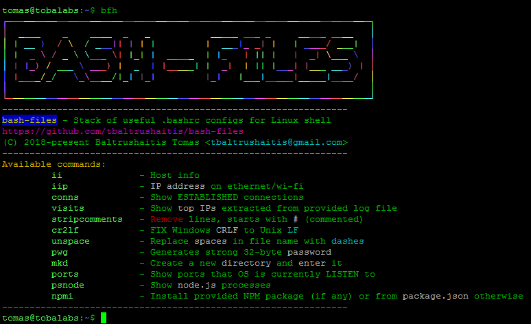

<p align="center">
  <h2 align="center">Easy Shell</h2>
  <p align="center">
    <a href="https://github.com/tbaltrushaitis/bash-files/stargazers"></a>
  </p>
</p>

<p align="center">
  <a href="#">
    
  </a>
</p>

<!-- # Linux Configs :: Stack of useful .bashrc configs for OS Linux shell # -->

<p align="center">
  <h4 align="center">Useful <strong>.bashrc</strong> configs for Linux shell</h4>
  <h6 align="center">Makes work in Linux terminal more informative, fun and faster</h6>
</p>

<!-- <p align="center">
<a href="https://github.com/tbaltrushaitis/bash-files/blob/master/LICENSE"></a>
</p> -->

`bash` `shell` `bashrc` `tips-and-tricks` `configuration` `bash-scripting` `shell-scripts` `colorization` `linux-shell`

#### :package: Provides: ####
- [x] Colorful console logging :cl:
- [x] Easy-to-remember aliases for many standard commands with optimal predefined params values
- [x] Up to 70% economy of your keyboard input time :hourglass:
- [x] Collect, gather and show basic system stats for fast incidents investigation :mag:
- [x] Create file `/etc/banner` with `$(hostname -s)` as context within [figlet]

#### How to setup this useful **.bashrc configs** into your OS? ####
Installation is so easy so even koala :koala: can do it. Read below! :point_down:

---

## Usage ##

### 1. Download ###
```shell
$ APP_USER="tbaltrushaitis" \
&& APP_NAME="bash-files" \
&& git clone https://github.com/${APP_USER}/${APP_NAME}.git \
&& cd ${APP_NAME} ;
```

### 2. Setup for current user and root ###
```shell
$ make
```

<div align="center">
  
</div>

---

## 3. Thats all. Enjoy! ##

<div align="center">
  
</div>

---

## Aliases explained ##

<details open>
  <summary>bfh - Help topic</summary>
  <div align="center">
    
  </div>
</details>

<details>
<summary>ii - Show basic hardware and networking information about the host</summary>
<div align="center">

</div>
</details>

<details>
<summary>zz - Become root</summary>
<div align="center">

</div>
</details>

<details>
<summary>qq - Logout from current session</summary>
<div align="center">

</div>
</details>

<details>
  <summary>h - Show commands history</summary>
  <div align="center">
    
  </div>
</details>

<details>
  <summary>visits - List of top ip-addresses extracted from given log file</summary>
  <div align="center">
    
  </div>
</details>

---

## Special tools aliases ##

| + | Input | Execute | Description |
|:-:|:-----:|:--------|:------------|
| - | visits | f(\<LOG_FILE>, [COUNT=10]) | Show top `COUNT` IPs extracted from `LOG_FILE` |
| - | delempty | find . -type f -size 0 -exec rm -v {} \; | Find all empty files and delete them |
| - | scs | screen -ls | Show list of active screens |
| - | scx | screen -x | Attach to the screen which name is provided as parameter |
| - | scr | screen -S "sockname" | Create new screen session with name provided as parameter, e.g. \<pid>.sockname |
| - | psnode | ps ax \| grep node | Show `node.js` processes |
| - | psport | ps -x \| grep "${PORT}" \| awk '{print $1}' | Show PID of process listeing on `PORT` |
| - | zz | sudo -i | Become root |
| - | qq | exit | Exit current session |
| - | iip | f() | Show IP adress on ethernet/wi-fi |
| - | conns | f() | Output list of ESTABLISHED network connections |
| - | stripcomments | sed -r "/^(#\|$)/d" -i \<FILE> | Remove commented (starts with #) and blank lines from `FILE` |
| - | nocomment | grep -Ev "^(#\|$)" \<FILE> | Show `FILE` contents without commented (starts with #) and blank lines |
| - | cr2lf | sed -i 's/\r$//' \<FILE> | Convert Windows (`CRLF`) to Unix (`LF`) in \<FILE> |
| - | unspace | f(\<FILE>) | Replace spaces with dashes in `FILE`'s name |
| - | pwg | pwgen -s1 32 | Generates strong 32-byte password |
| - | mkd | f(\<DIR_NAME>) | Create a new directory `DIR_NAME` and enter it |
| - | count | find . -type f \| wc -l | Recursively count files in the current directory |
| - | npmi | npmi() | Install dependencies (if any provided) or from `package.json` file otherwise

---

## Full command-line aliases list ##

| + | Input | Execute | Description |
|:-:|:-----:|:--------|:------------|
| - | med | mcedit -a | Run Midnight Commander's editor |
| - | .. | cd .. | Go up 1 level |
| - | c | clear | Clear terminal window |
| - | screenls | screen -ls | Show list of active screens |
| - | k9 | kill -9 | Send `-HUP` signal to process |
| - | npmr | npm run | -
| - | npms | npm start | -
| - | npmt | npm run test | -
| - | npmb | npm run build | -
| - | npmo | npm outdated | -
| - | alert | notify-send --urgency | -
| - | chgrp | chgrp --preserve-root | -
| - | chmod | chmod --preserve-root | -
| - | chown | chown --preserve-root | -
| - | cp | cp -prb | -
| - | cpuinfo | lscpu | -
| - | curli | curl -I | -
| - | debug | set -o nounset; set -o xtrace | -
| - | df | df -kTH | -
| - | dir | dir --color | -
| - | du | du -kh | -
| - | egrep | egrep --color | -
| - | fastping | ping -c 100 -s.2 | -
| - | fgrep | fgrep --color | -
| - | grep | grep --color | -
| - | h | history | Show commands history |
| - | headerc | curl -I --compress | -
| - | httpdtest | sudo /usr/sbin/apachectl -t && /usr/sbin/apachectl -S | -
| - | httpdreload | sudo /usr/sbin/apachectl -k graceful | -
| - | httpdrestart | sudo /etc/init.d/httpd restart | -
| - | ipt | sudo /sbin/iptables -n -v --line-numbers -L | -
| - | iptlist | ipt | -
| - | iptlistfw | ipt FORWARD | -
| - | iptlistin | ipt INPUT | -
| - | iptlistout | ipt OUTPUT | -
| - | firewall | iptlist | -
| - | j | jobs -l | -
| - | l | ls -CF | -
| - | la | ll -A | -
| - | lc | ls -ltcr | -
| - | libpath | echo -e ${LD_LIBRARY_PATH//:/\\n} | -
| - | lk | ls -lSr | -
| - | ll | ls -lvF | -
| - | ln | ln -i | -
| - | lr | ll -R | -
| - | ls | ls --color | -
| - | lt | ls -ltr | -
| - | lu | ls -ltur | -
| - | lx | ls -lXB | -
| - | meminfo | free -m -l -t | -
| - | mkdir | mkdir -p | -
| - | most | du -shx * \| grep -w "[0-9]*G" | -
| - | mount | mount \| column -t | -
| - | partusage | df -hlT --exclude-type | -
| - | path | echo -e ${PATH//:/\\n} | -
| - | ports | netstat -tulanp | -
| - | pscpu | ps auxf \| sort -nr -k 3 | -
| - | pscpu10 | ps auxf \| sort -nr -k 3 \| head -10 | -
| - | psmem | ps auxf \| sort -nr -k 4 | -
| - | psmem10 | ps auxf \| sort -nr -k 4 \| head -10 | -
| - | rights | f() | Set 775 on dirs, 664 on files and a+x on *.sh scripts |
| - | rm | rm -i --preserve-root | -
| - | sha1 | openssl sha1 | -
| - | totalusage | df -hl --total \| grep total | -
| - | usage | du -h --max-depth | -
| - | which | type -a | -

---

### Snippet that create structure for the table above ###

```shell
## markdown of the above table prepared with this snippet:
$  echo "| + | Input | Execute | Description |" \
&& echo "|:-:|:-----:|:--------|:------------|" \
&& alias | cut -b7- | awk -F"=" '{print "| " $1 " | " $2 " |"}'
```

---

## CHANGELOG ##

See the [Changelog][Changelog] file for details

---

> **Note:**  We're ready to get help in creation of tomorrow web ... maybe its you just come there as a new contributor?

---

### :link: More Info ###

 - [GitHub / Basic writing and formatting syntax](https://help.github.com/articles/basic-writing-and-formatting-syntax/)
 - [BitBucket / Markdown Howto](https://bitbucket.org/tutorials/markdowndemo)
 - [Docker / Creating an Automated Build](https://docs.docker.com/docker-hub/builds/)

---

> :calendar: Developed on **20th of November 2016**

:scorpion:

[Changelog]: CHANGELOG.md
[figlet]: http://www.figlet.org/
